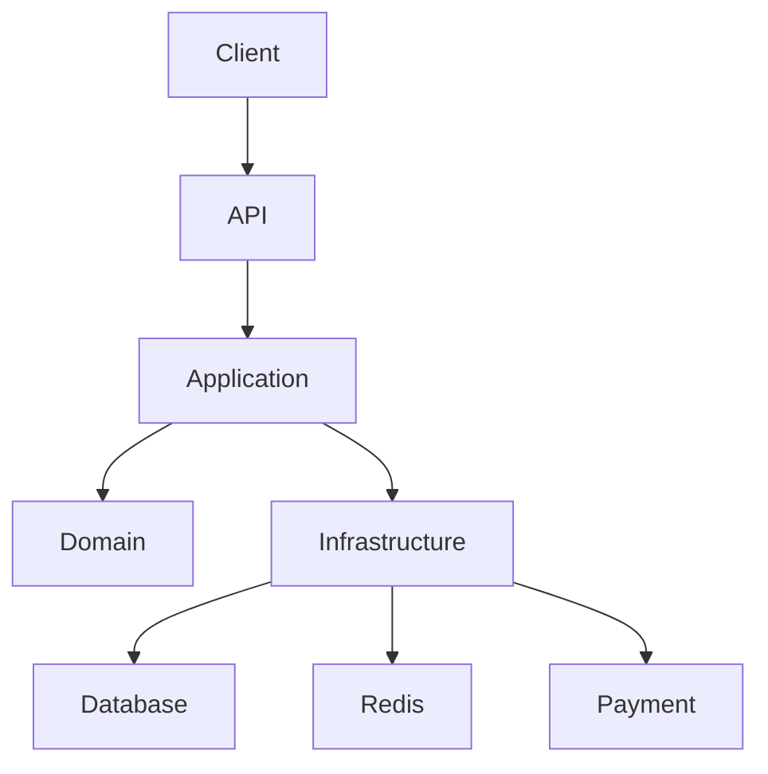

# Master Prompt — Build a Production-Style E-Commerce Backend in .NET

You are a senior .NET software architect and backend engineer.

I want you to build a complete, production-quality **E-Commerce Backend Platform** from scratch using **ASP.NET Core and C#**.

Do not treat this as a simple CRUD application. The goal is to build a realistic, scalable backend that demonstrates good software architecture, clean separation of responsibilities, asynchronous programming, EF Core, authentication, authorization, inventory management, order processing, payments, caching, background processing, real-time notifications, unit testing, and integration testing.

The application should initially be implemented as a **Modular Monolith using Clean Architecture principles**.

Do not start with microservices. The architecture must, however, be modular enough that individual modules could be extracted into microservices in the future.

---

# 1. Technology Stack

Use the current stable/LTS .NET version available in the development environment.

Primary technologies:

- C#
- ASP.NET Core Web API
- Entity Framework Core
- SQL Server or PostgreSQL
- Redis
- JWT authentication
- ASP.NET Core Authorization
- SignalR
- xUnit
- Moq or an equivalent mocking framework
- ASP.NET Core integration testing
- Docker
- OpenAPI/Swagger
- Structured logging using Microsoft.Extensions.Logging
- Background jobs
- Outbox pattern for reliable event publishing

Prefer built-in .NET/ASP.NET Core functionality where practical.

Do not introduce unnecessary third-party libraries merely for the sake of using them.

If a library is introduced, explain why it is needed.

---

# 2. Overall Architecture

Use this architecture:

```text
                         CLIENTS
                   Web / Mobile / Admin
                           |
                           | HTTPS
                           v
                  +--------------------+
                  |   ECommerce.Api    |
                  | Controllers        |
                  | Middleware         |
                  | Authentication     |
                  | Authorization      |
                  +---------+----------+
                            |
                            v
                  +--------------------+
                  | ECommerce.Application|
                  | Use Cases            |
                  | Services             |
                  | Commands             |
                  | Queries              |
                  | DTOs                 |
                  +---------+------------+
                            |
                            v
                  +--------------------+
                  |  ECommerce.Domain   |
                  | Entities             |
                  | Value Objects        |
                  | Business Rules       |
                  | Domain Events        |
                  +--------------------+
                            ^
                            |
                  +---------+------------+
                  | ECommerce.Infrastructure
                  | EF Core              |
                  | Repositories         |
                  | Redis                |
                  | Payments             |
                  | Authentication       |
                  | Background Jobs      |
                  | Messaging             |
                  | SignalR              |
                  +---------------------+
```

The dependency direction must follow Clean Architecture principles.

The Domain layer must remain independent from infrastructure concerns.

The Domain must NOT reference:

- ASP.NET Core
- EF Core
- SQL Server
- PostgreSQL
- Redis
- JWT
- Stripe/Razorpay/etc.
- HTTP
- Controllers
- UI concerns

The Application layer should depend on Domain abstractions.

Infrastructure should implement interfaces required by Application/Domain.

The API layer should depend on Application and Infrastructure only for composition/DI.

---

# 3. Solution Structure

Create the following solution:

```text
ECommerce.sln
│
├── src
│   │
│   ├── ECommerce.Domain
│   │
│   ├── ECommerce.Application
│   │
│   ├── ECommerce.Infrastructure
│   │
│   └── ECommerce.Api
│
├── tests
│   │
│   ├── ECommerce.UnitTests
│   │
│   └── ECommerce.IntegrationTests
│
├── docs
│
├── docker
│
├── .gitignore
├── README.md
└── Directory.Build.props
```

Use appropriate project references.

Expected dependency structure:

```text
ECommerce.Api
    |
    +----> ECommerce.Application
    |
    +----> ECommerce.Infrastructure

ECommerce.Infrastructure
    |
    +----> ECommerce.Application
    |
    +----> ECommerce.Domain

ECommerce.Application
    |
    +----> ECommerce.Domain

ECommerce.Domain
    |
    +----> No application/infrastructure dependency
```

---

# 4. Domain Layer

The Domain layer represents the business model.

Create the following entities initially:

```text
Product
Category
Inventory
User
Address
Cart
CartItem
Order
OrderItem
Payment
```

Create appropriate enums:

```text
OrderStatus
PaymentStatus
UserRole
PaymentMethod
```

Potential OrderStatus values:

```text
Pending
PaymentProcessing
Confirmed
Packed
Shipped
Delivered
Cancelled
PaymentFailed
```

Potential PaymentStatus values:

```text
Pending
Processing
Succeeded
Failed
Refunded
```

Potential roles:

```text
Customer
Admin
```

---

# 5. Domain Entity Requirements

Entities should encapsulate their state.

Do NOT create an anemic domain model with unrestricted public setters.

Prefer:

```csharp
public void ChangePrice(decimal price)
{
    if (price <= 0)
        throw new DomainException("Price must be greater than zero.");

    Price = price;
}
```

instead of allowing:

```csharp
product.Price = -100;
```

Business rules should live in the appropriate domain entity/domain service.

Examples:

Product:

- Name cannot be empty.
- SKU is required.
- Price must be greater than zero.
- Product must belong to a valid category.
- Inactive products cannot be purchased.

Inventory:

- Available quantity cannot become negative.
- Reserved quantity cannot become negative.
- Cannot reserve more stock than available.
- Stock release must be valid.

Order:

- Order must contain at least one item.
- Order total must be valid.
- Invalid order-status transitions must be rejected.
- Delivered orders cannot be moved back to Pending.
- Cancelled orders cannot be confirmed.
- Payment failure should transition the order appropriately.

Payment:

- Amount must be positive.
- Payment status transitions must be valid.

---

# 6. Value Objects

Use value objects where appropriate.

Create:

```text
Money
Email
AddressValue
```

For example, Email should encapsulate email validation.

Money should prevent invalid monetary values.

Avoid scattering validation logic throughout controllers.

---

# 7. Domain Exceptions

Create domain-specific exceptions such as:

```text
DomainException
ProductNotFoundException
InsufficientStockException
InvalidOrderStateException
PaymentException
```

Do not use generic exceptions for every business rule.

---

# 8. Domain Events

Introduce domain/application events for important operations.

Initially create events such as:

```text
ProductCreatedEvent
OrderCreatedEvent
OrderPlacedEvent
PaymentCompletedEvent
PaymentFailedEvent
OrderStatusChangedEvent
```

The event system should eventually integrate with the Outbox pattern.

---

# 9. Application Layer

The Application layer contains business use cases.

Organize the application by business module rather than by technical type alone.

Use this structure:

```text
ECommerce.Application
│
├── Common
│   ├── Interfaces
│   ├── Models
│   ├── Behaviors
│   └── Exceptions
│
├── Products
│   ├── Commands
│   │   ├── CreateProduct
│   │   ├── UpdateProduct
│   │   └── DeleteProduct
│   │
│   ├── Queries
│   │   ├── GetProduct
│   │   └── GetProducts
│   │
│   └── DTOs
│
├── Inventory
│   ├── Commands
│   │   ├── AddStock
│   │   ├── ReserveStock
│   │   └── ReleaseStock
│   │
│   ├── Queries
│   │   └── GetInventory
│   │
│   └── DTOs
│
├── Authentication
│   ├── Commands
│   │   ├── Register
│   │   └── Login
│   │
│   ├── DTOs
│   └── Services
│
├── Cart
│   ├── Commands
│   ├── Queries
│   └── DTOs
│
├── Orders
│   ├── Commands
│   │   ├── CreateOrder
│   │   ├── CancelOrder
│   │   └── UpdateOrderStatus
│   │
│   ├── Queries
│   │   ├── GetOrder
│   │   └── GetOrders
│   │
│   └── DTOs
│
├── Checkout
│
├── Payments
│
└── DependencyInjection.cs
```

---

# 10. Async Programming

All I/O operations must be asynchronous.

Use:

```csharp
Task<T>
Task
async
await
CancellationToken
```

Do not block asynchronous operations using:

```csharp
.Result
.Wait()
.GetAwaiter().GetResult()
```

Propagate CancellationToken through:

```text
Controller
    ↓
Application Service
    ↓
Repository
    ↓
EF Core
```

For example:

```csharp
Task<Product?> GetByIdAsync(
    Guid id,
    CancellationToken cancellationToken);
```

Use EF Core asynchronous methods:

```text
FirstOrDefaultAsync
ToListAsync
AnyAsync
CountAsync
SaveChangesAsync
```

---

# 11. Application Interfaces

Define abstractions in the Application layer.

Examples:

```text
IProductRepository
ICategoryRepository
IInventoryRepository
IUserRepository
ICartRepository
IOrderRepository
IPaymentRepository
IUnitOfWork
IPaymentService
ICacheService
IEmailService
INotificationService
IEventPublisher
IDateTimeProvider
```

Application code should depend on abstractions.

---

# 12. DTOs

Never expose Domain entities directly from API endpoints.

Create request/response DTOs.

For example:

```text
CreateProductRequest
UpdateProductRequest
ProductResponse
ProductListResponse

RegisterRequest
LoginRequest
LoginResponse

AddCartItemRequest
CartResponse

CreateOrderRequest
OrderResponse

CheckoutRequest
CheckoutResponse

PaymentResponse
```

Keep API contracts separate from Domain entities.

---

# 13. Product Catalog

Implement complete product catalog functionality.

Endpoints:

```http
GET    /api/products
GET    /api/products/{id}

POST   /api/products
PUT    /api/products/{id}
DELETE /api/products/{id}
```

Support:

- Pagination
- Searching
- Filtering
- Sorting
- Category filtering
- Active/inactive products

Examples:

```http
GET /api/products?page=1&pageSize=20
GET /api/products?search=laptop
GET /api/products?category=electronics
GET /api/products?sortBy=price&sortDirection=asc
```

Pagination should return metadata:

```json
{
  "items": [],
  "page": 1,
  "pageSize": 20,
  "totalCount": 100,
  "totalPages": 5
}
```

Do not load the entire table into memory.

Use database-side pagination.

---

# 14. Inventory Management

Inventory must support:

```text
AvailableQuantity
ReservedQuantity
```

Example:

```text
Available = 100
Reserved = 0
```

Reserve 5:

```text
Available = 95
Reserved = 5
```

Release 5:

```text
Available = 100
Reserved = 0
```

Implement:

```text
GetInventory
AddStock
ReserveStock
ReleaseStock
```

Important:

Inventory reservation must handle concurrent requests correctly.

Do not allow overselling.

Use an appropriate EF Core/database concurrency mechanism such as optimistic concurrency.

Test concurrent checkout/reservation scenarios.

---

# 15. Authentication

Implement:

```http
POST /api/auth/register
POST /api/auth/login
```

Registration flow:

```text
Request
 ↓
Validate
 ↓
Check whether email already exists
 ↓
Hash password
 ↓
Create User
 ↓
Persist User
 ↓
Return response
```

Never store plain-text passwords.

Login flow:

```text
Email + Password
       ↓
Find user
       ↓
Verify password hash
       ↓
Generate JWT
       ↓
Return access token
```

JWT should include appropriate claims such as:

```text
UserId
Email
Role
```

Configure ASP.NET Core authentication and authorization.

---

# 16. Authorization

Customer permissions:

```text
Browse products
View product details
Manage own cart
Checkout
View own orders
Track own orders
```

Admin permissions:

```text
Create products
Update products
Delete/deactivate products
Manage inventory
View orders
Update order status
```

Use role-based authorization where appropriate.

Ensure users cannot access another customer's order data.

---

# 17. Cart

Implement:

```http
GET    /api/cart
POST   /api/cart/items
PUT    /api/cart/items/{id}
DELETE /api/cart/items/{id}
DELETE /api/cart
```

Rules:

- A user can have one active cart.
- Product must exist.
- Product must be active.
- Quantity must be positive.
- Do not trust price supplied by the client.
- Product price must be retrieved from the server.
- Validate inventory during checkout.

---

# 18. Orders

Implement:

```http
POST /api/orders
GET  /api/orders
GET  /api/orders/{id}
POST /api/orders/{id}/cancel
```

Customers should only see their own orders.

Admins can view/manage appropriate orders.

Order items should capture the price at the time of purchase.

Do not calculate historical order prices from the current Product table.

For example:

```text
Product current price = ₹1500

Order created:
OrderItem.UnitPrice = ₹1200
```

If the product price later becomes ₹1500, the historical order remains ₹1200.

---

# 19. Checkout

Checkout is the most important business workflow.

Implement a dedicated checkout application service.

The workflow should conceptually be:

```text
Checkout Request
       |
       v
Validate User
       |
       v
Load Cart
       |
       v
Validate Cart
       |
       v
Load Current Product Information
       |
       v
Validate Product Availability
       |
       v
Calculate Total
       |
       v
Reserve Inventory
       |
       v
Create Order
       |
       v
Create Payment
       |
       v
Process Payment
       |
   +---+---+
   |       |
 FAIL    SUCCESS
   |       |
   v       v
Release   Confirm
Stock     Order
           |
           v
       Publish Event
```

The checkout workflow must correctly handle failures.

If payment fails:

```text
Payment = Failed
Order = PaymentFailed/Cancelled
Inventory reservation = released
```

Do not leave inventory permanently reserved.

---

# 20. Payment abstraction

Do not tightly couple the application to one payment provider.

Create:

```csharp
public interface IPaymentService
{
    Task<PaymentResult> ProcessPaymentAsync(
        PaymentRequest request,
        CancellationToken cancellationToken);
}
```

Implement the actual provider inside Infrastructure.

For development/testing, also create:

```text
MockPaymentService
```

so automated tests don't depend on a real payment provider.

The architecture should allow adding another provider later.

---

# 21. Payment Idempotency

Payment operations must be idempotent.

Support an idempotency key such as:

```http
Idempotency-Key: abc123
```

If the same payment request is submitted twice with the same key:

```text
First request
    ↓
Payment processed
    ↓
Result stored

Second request
    ↓
Same idempotency key
    ↓
Return previous result
```

Do not charge the customer twice.

Test duplicate payment requests.

---

# 22. Payment Webhooks

Design the payment subsystem to support provider webhooks.

Example:

```http
POST /api/payments/webhook
```

The webhook should:

- Validate authenticity/signature where applicable.
- Identify the payment.
- Update payment status.
- Update order status.
- Be idempotent.
- Handle duplicate webhook deliveries.

Do not trust arbitrary webhook payloads without verification.

---

# 23. Transactions

Use database transactions where appropriate.

For operations such as:

```text
Create Order
Reserve Inventory
Create Payment Record
```

ensure database state remains consistent.

However, do NOT keep a SQL transaction open while waiting for a slow external payment API.

Design external payment processing carefully.

Use concepts such as:

```text
Idempotency
Outbox
Compensating actions
State transitions
```

where appropriate.

---

# 24. Repository Pattern

Implement repositories in Infrastructure.

Example:

```text
IProductRepository
        ↓
ProductRepository
        ↓
ECommerceDbContext
        ↓
Database
```

Repositories should use EF Core asynchronously.

Avoid creating a massive generic repository that hides every EF Core capability.

Prefer meaningful, domain-oriented repositories.

---

# 25. Unit of Work

If appropriate, create:

```text
IUnitOfWork
```

with:

```csharp
Task<int> SaveChangesAsync(
    CancellationToken cancellationToken);
```

EF Core's DbContext already behaves like a unit of work, so don't introduce unnecessary abstraction merely for ceremony.

Use the abstraction if it improves the application's architecture/testability.

---

# 26. EF Core

Create:

```text
ECommerceDbContext
```

DbSets:

```text
Products
Categories
Users
Addresses
Carts
CartItems
Inventory
Orders
OrderItems
Payments
OutboxMessages
```

Use separate configurations:

```text
Persistence
│
├── ECommerceDbContext.cs
│
├── Configurations
│   ├── ProductConfiguration.cs
│   ├── CategoryConfiguration.cs
│   ├── UserConfiguration.cs
│   ├── InventoryConfiguration.cs
│   ├── CartConfiguration.cs
│   ├── OrderConfiguration.cs
│   └── PaymentConfiguration.cs
│
├── Repositories
│
└── Migrations
```

Use:

```text
IEntityTypeConfiguration<T>
```

for entity mapping.

Configure:

- Primary keys
- Foreign keys
- Indexes
- Unique constraints
- Required fields
- String lengths
- Decimal precision
- Relationships
- Concurrency tokens

---

# 27. Database Relationships

Model relationships approximately as:

```text
Category
   |
   +---- Products
             |
             +---- Inventory

User
 |
 +---- Cart
 |       |
 |       +---- CartItems
 |                |
 |                +---- Product
 |
 +---- Orders
 |       |
 |       +---- OrderItems
 |       |       |
 |       |       +---- Product
 |       |
 |       +---- Payment
 |
 +---- Addresses
```

Add proper foreign keys and indexes.

Important indexes should include fields such as:

```text
Product.Sku
User.Email
Order.UserId
Order.OrderNumber
Order.CreatedAt
Inventory.ProductId
```

where appropriate.

---

# 28. Global Exception Handling

Implement centralized exception handling.

Do not duplicate try/catch blocks across controllers.

Use middleware or ASP.NET Core's exception handling infrastructure.

Return consistent errors.

Prefer Problem Details or an equivalent standardized structure.

Examples:

```text
400 Bad Request
401 Unauthorized
403 Forbidden
404 Not Found
409 Conflict
422 Validation Error
500 Internal Server Error
```

Map business exceptions appropriately.

For example:

```text
InsufficientStockException
        ↓
409 Conflict
```

---

# 29. Validation

Implement request validation.

Validate:

- Required values
- String lengths
- Email format
- Positive quantities
- Positive prices
- Valid IDs
- Password requirements

Also enforce business rules in the Domain.

Do not rely only on API validation.

---

# 30. Logging

Implement structured logging.

Log important events such as:

```text
User registered
User login succeeded/failed
Product created
Stock reserved
Order created
Payment succeeded
Payment failed
Order status changed
Background job failed
Webhook received
```

Use structured logging:

```csharp
_logger.LogInformation(
    "Order {OrderId} created for User {UserId}",
    orderId,
    userId);
```

Never log:

```text
Passwords
JWT tokens
Credit card numbers
Payment secrets
Sensitive credentials
```

---

# 31. Configuration

Use configuration through:

```text
appsettings.json
appsettings.Development.json
Environment Variables
User Secrets
```

Create strongly typed options where appropriate.

Example:

```text
JwtOptions
DatabaseOptions
RedisOptions
PaymentOptions
EmailOptions
```

Do not hardcode:

```text
Connection strings
JWT secrets
API keys
Payment secrets
```

---

# 32. Dependency Injection

Create:

```text
ECommerce.Application/DependencyInjection.cs
ECommerce.Infrastructure/DependencyInjection.cs
```

Application should register its services.

Infrastructure should register:

```text
DbContext
Repositories
Payment services
Cache service
Email service
Background services
Messaging
```

API's Program.cs should remain relatively clean.

Conceptually:

```csharp
builder.Services.AddApplication();

builder.Services.AddInfrastructure(
    builder.Configuration);
```

---

# 33. Caching

Add Redis support.

Create:

```text
ICacheService
RedisCacheService
```

Good caching candidates:

```text
Product details
Product catalog queries
Categories
```

Avoid blindly caching highly mutable data such as inventory.

Implement cache invalidation when products/categories change.

Example:

```text
GET Product
    ↓
Check Redis
    ↓
Cache Hit → Return
    ↓
Cache Miss
    ↓
Database
    ↓
Store in Redis
    ↓
Return
```

Use sensible TTLs.

---

# 34. Background Jobs

Implement background processing for tasks that should not block HTTP requests.

Potential jobs:

```text
Send order confirmation email
Send invoice
Process outbox messages
Send notifications
Retry failed external operations
Clean expired data
```

The HTTP request should not wait for email delivery.

For example:

```text
Order Created
     |
     +---- Save Order
     |
     +---- Return API response
     |
     +---- Background job
              |
              +---- Send email
              +---- Send notification
```

---

# 35. Outbox Pattern

Implement an Outbox table:

```text
OutboxMessages
--------------
Id
EventType
Payload
CreatedAt
ProcessedAt
RetryCount
Error
```

When an important business operation occurs:

```text
BEGIN TRANSACTION

Create Order

Create OutboxMessage
    OrderPlaced

COMMIT
```

Then a background worker processes:

```text
OutboxMessage
      ↓
Publish Event
      ↓
Send Email
      ↓
SignalR Notification
      ↓
Mark Processed
```

This prevents the situation where the database transaction succeeds but event publishing fails.

Implement retry behavior.

Make processing idempotent.

---

# 36. Real-Time Notifications

Use SignalR.

Create:

```text
OrderHub
```

Customers should be able to receive real-time order updates.

Example:

```text
Order 123
Pending
   ↓
Confirmed
   ↓
Packed
   ↓
Shipped
   ↓
Delivered
```

When the order changes:

```text
Order Service
      ↓
OrderStatusChangedEvent
      ↓
Notification Service
      ↓
SignalR
      ↓
Customer
```

Clients should not need to continuously poll for order status.

Ensure users can only receive notifications for orders they are authorized to see.

---

# 37. Testing Strategy

Testing is a major requirement.

Create:

```text
ECommerce.UnitTests
ECommerce.IntegrationTests
```

---

# 38. Unit Tests

Unit test Domain and Application logic independently.

Test:

```text
Product business rules
Inventory business rules
Order state transitions
Payment state transitions
Checkout
Authentication logic
Cart logic
Price calculation
```

Examples:

```text
Should not allow negative product price

Should not reserve more stock than available

Should release inventory when payment fails

Should create order successfully when payment succeeds

Should reject invalid order state transition

Should not allow duplicate payment

Should not allow empty cart checkout

Should not allow inactive product checkout
```

Use mocks for external dependencies.

---

# 39. Integration Tests

Integration tests should exercise:

```text
HTTP
 ↓
Controller
 ↓
Application
 ↓
Infrastructure
 ↓
EF Core
 ↓
Test database
```

Test API endpoints end-to-end.

Examples:

```text
Register user
Login user
Create product
Get product
Search products
Add stock
Add item to cart
Checkout
Get order
Cancel order
Update order status
Payment webhook
```

Verify both:

```text
HTTP response
```

and:

```text
Database state
```

---

# 40. Authentication Integration Tests

Test:

```text
Registration succeeds
Duplicate email fails
Invalid password fails
Login succeeds
Invalid credentials fail
Protected endpoint rejects unauthenticated user
Admin endpoint rejects customer
Customer cannot access another user's order
```

---

# 41. Checkout Integration Tests

Create comprehensive scenarios:

```text
Successful checkout

Empty cart

Product not found

Inactive product

Insufficient stock

Payment failure

Payment timeout

Duplicate checkout request

Duplicate payment request

Inventory reservation failure

Concurrent checkout

Price changed before checkout

Order creation failure

Payment webhook

Duplicate webhook
```

---

# 42. API Design

Use RESTful conventions.

Examples:

```http
GET    /api/products
GET    /api/products/{id}
POST   /api/products
PUT    /api/products/{id}
DELETE /api/products/{id}
```

Use appropriate HTTP status codes.

For example:

```text
200 OK
201 Created
204 No Content
400 Bad Request
401 Unauthorized
403 Forbidden
404 Not Found
409 Conflict
422 Unprocessable Entity
500 Internal Server Error
```

---

# 43. API Documentation

Configure Swagger/OpenAPI.

Document:

- Endpoints
- Request models
- Response models
- Authentication
- Error responses
- Required headers
- Pagination
- Filtering
- Idempotency keys

Swagger should allow authenticated endpoint testing.

---

# 44. Database Seeding

Create development seed data.

Seed:

```text
Admin user
Sample customer
Categories
Products
Inventory
```

Never seed real production secrets.

Make seed data deterministic and safe to run repeatedly.

---

# 45. Docker

Create Docker support.

At minimum:

```text
Dockerfile
docker-compose.yml
```

Development environment should be able to run:

```text
ASP.NET Core API
Database
Redis
```

Potential architecture:

```text
docker-compose
   |
   +---- API
   |
   +---- SQL Server/PostgreSQL
   |
   +---- Redis
```

Do not require production infrastructure just to run locally.

---

# 46. Health Checks

Add health endpoints.

Check:

```text
API
Database
Redis
```

Expose something like:

```http
GET /health
GET /health/ready
```

Distinguish liveness and readiness where appropriate.

---

# 47. Security Requirements

Implement appropriate security practices.

At minimum:

```text
HTTPS
JWT authentication
Role-based authorization
Password hashing
Input validation
Rate limiting where appropriate
CORS configuration
Secure configuration
Secret management
Safe database access
```

Do not expose internal exception details in production.

Do not expose sensitive configuration values.

Do not log sensitive credentials.

---

# 48. Performance Requirements

Avoid obvious performance problems.

Do not:

```text
Load entire product table
Load unnecessary navigation properties
Execute N+1 queries
Perform synchronous database calls
Cache everything
```

Use:

```text
AsNoTracking()
Pagination
Projection
Indexes
Async EF Core
Redis
```

where appropriate.

For read-only queries, consider projecting directly to DTOs instead of loading complete entities.

---

# 49. Database Query Example

For product listing, prefer a query conceptually like:

```text
Database
    ↓
Filter
    ↓
Sort
    ↓
Project
    ↓
Paginate
    ↓
Return
```

rather than:

```text
Database
    ↓
Load everything
    ↓
Convert to objects
    ↓
Filter in memory
```

---

# 50. API Layer Folder Structure

Use approximately:

```text
ECommerce.Api
│
├── Controllers
│   ├── AuthController.cs
│   ├── ProductsController.cs
│   ├── InventoryController.cs
│   ├── CartController.cs
│   ├── OrdersController.cs
│   ├── CheckoutController.cs
│   └── PaymentsController.cs
│
├── Middleware
│   ├── ExceptionHandlingMiddleware.cs
│   └── RequestLoggingMiddleware.cs
│
├── Models
│   ├── Requests
│   └── Responses
│
├── Configuration
│
├── Extensions
│
├── Program.cs
├── appsettings.json
└── appsettings.Development.json
```

Keep controllers thin.

---

# 51. Infrastructure Folder Structure

Use approximately:

```text
ECommerce.Infrastructure
│
├── Persistence
│   ├── ECommerceDbContext.cs
│   │
│   ├── Configurations
│   │
│   ├── Repositories
│   │
│   ├── Migrations
│   │
│   └── Outbox
│
├── Authentication
│   ├── JwtTokenService.cs
│   └── PasswordHasher.cs
│
├── Payments
│   ├── PaymentService.cs
│   └── MockPaymentService.cs
│
├── Caching
│   └── RedisCacheService.cs
│
├── BackgroundJobs
│
├── Messaging
│
├── Notifications
│   └── OrderHub.cs
│
├── Email
│
└── DependencyInjection.cs
```

---

# 52. Coding Standards

Use:

- Nullable reference types
- File-scoped namespaces
- Records for immutable DTOs where appropriate
- Async/await
- CancellationToken
- Dependency injection
- SOLID principles
- Clear naming
- Small focused classes
- Guard clauses
- Structured logging
- XML comments only where useful
- No unnecessary comments explaining obvious code

Avoid:

```text
God classes
God services
Huge controllers
Static service classes
Service locator
Global mutable state
Business logic in controllers
Business logic in repositories
Business logic in EF configurations
Hard-coded secrets
Magic strings
Duplicated logic
```

---

# 53. SOLID Principles

Design the application with SOLID principles.

Examples:

Single Responsibility:

```text
ProductRepository
```

should handle product persistence, not email.

Open/Closed:

Payment implementations should be replaceable.

Liskov:

Implementations should honor their interfaces.

Interface Segregation:

Avoid one massive:

```text
IECommerceService
```

containing 50 methods.

Dependency Inversion:

Application should depend on:

```text
IPaymentService
IProductRepository
ICacheService
```

rather than concrete infrastructure classes.

---

# 54. Do Not Overengineer

Do not introduce abstractions without a purpose.

For example, don't create:

```text
IProductFactoryFactory
IServiceResolver
IGenericManager
```

unless there is a real architectural reason.

The code should remain understandable to a developer who is familiar with C# and ASP.NET Core but is still learning enterprise architecture.

---

# 55. Important Business Rules

The following rules must be explicitly implemented and tested.

### Product

```text
Price > 0
SKU unique
Name required
Inactive product cannot be purchased
```

### Inventory

```text
Available >= 0
Reserved >= 0
Cannot reserve more than available
Cannot release more than reserved
Handle concurrent reservation
```

### Cart

```text
Quantity > 0
Product must exist
Product must be active
Price comes from server
```

### Order

```text
At least one item
Total must be correct
Historical item price must be stored
Valid status transitions only
Customer sees only own orders
```

### Payment

```text
Amount > 0
Idempotent processing
Duplicate webhook safe
Failure handled correctly
```

### Checkout

```text
Validate cart
Validate product
Validate current price
Validate inventory
Reserve inventory
Create order
Process payment
Release inventory if payment fails
Confirm order after successful payment
```

---

# 56. Observability

Prepare the application for production observability.

Include:

```text
Structured logs
Correlation/request IDs
Health checks
Useful error information
Performance-sensitive logging
```

If practical, prepare the architecture for metrics and distributed tracing later.

---

# 57. README

Create a detailed README containing:

```text
Project overview
Architecture
Solution structure
Prerequisites
How to run
How to configure database
How to configure Redis
How to configure JWT
How to run migrations
How to seed database
How to run tests
How to run Docker
API documentation
Authentication flow
Checkout flow
Architecture decisions
```

Also document important tradeoffs.

---

# 58. Architecture Documentation

Under:

```text
docs/
```

create documentation such as:

```text
architecture.md
database.md
authentication.md
checkout.md
payment.md
caching.md
background-jobs.md
testing.md
```

Include diagrams using Mermaid where useful.

For example:



---

# 59. Implementation Strategy

Do NOT attempt to generate the entire application in one giant step.

Build incrementally.

Use this sequence.

## Phase 1 — Solution Foundation

Implement:

```text
Solution
Projects
Project references
Folder structure
DI
Configuration
Logging
Exception handling
Swagger
Health checks
```

At the end of Phase 1:

```bash
dotnet build
dotnet test
```

must succeed.

The API must start successfully.

---

## Phase 2 — Domain

Implement:

```text
Entities
Enums
Value Objects
Domain Exceptions
Domain Events
Business rules
```

Write unit tests for the domain.

---

## Phase 3 — Database

Implement:

```text
DbContext
EF Core configurations
Repositories
Migrations
Seed data
```

Create the database successfully.

---

## Phase 4 — Product Catalog

Implement:

```text
Product CRUD
Category
Search
Filtering
Sorting
Pagination
Validation
Tests
```

Make the complete vertical slice work before moving forward.

---

## Phase 5 — Inventory

Implement:

```text
Inventory
Add stock
Reserve stock
Release stock
Concurrency
Tests
```

---

## Phase 6 — Authentication

Implement:

```text
Registration
Password hashing
Login
JWT
Authentication
Authorization
Roles
Tests
```

---

## Phase 7 — Cart

Implement:

```text
Get cart
Add item
Update item
Remove item
Clear cart
Tests
```

---

## Phase 8 — Orders

Implement:

```text
Create order
Order history
Order details
Order status
Cancellation
Tests
```

---

## Phase 9 — Checkout

Implement:

```text
Checkout
Price calculation
Inventory reservation
Order creation
Payment integration
Failure handling
Transactions
Idempotency
Tests
```

---

## Phase 10 — Payments

Implement:

```text
Payment abstraction
Provider implementation
Mock provider
Payment status
Webhook
Idempotency
Refund architecture
Tests
```

---

## Phase 11 — Caching

Implement:

```text
Redis
Cache service
Product caching
Cache invalidation
Tests
```

---

## Phase 12 — Background Processing

Implement:

```text
Background jobs
Outbox
Event publishing
Retry
Email notification
```

---

## Phase 13 — SignalR

Implement:

```text
OrderHub
Order status notifications
Authorization
Real-time client updates
Integration tests
```

---

## Phase 14 — Production Readiness

Implement:

```text
Docker
Health checks
Logging improvements
Metrics readiness
Security hardening
Integration test coverage
Documentation
CI/CD-ready structure
```

---

# 60. Definition of Done

Do not consider a feature complete merely because it compiles.

A feature is complete when:

```text
Domain logic implemented
Application use case implemented
Infrastructure implemented
API endpoint implemented
Validation implemented
Logging implemented
Error handling implemented
Unit tests implemented
Integration tests implemented
Swagger documentation implemented
```

where applicable.

---

# 61. How I want you to work

Act as a senior engineer guiding the implementation.

Do not blindly generate thousands of lines of code.

For each phase:

1. Explain what we are building.
2. Explain why the architecture is designed that way.
3. Show the files that will be created/modified.
4. Implement the code.
5. Explain important parts of the implementation.
6. Build the project.
7. Run the tests.
8. Fix compilation/test issues.
9. Only then proceed to the next phase.

Maintain architectural consistency across all phases.

Do not rewrite previously working architecture without a strong reason.

If you discover a design problem, explain it before changing the architecture.

---

# 62. Code Quality Requirements

Before completing each phase, verify:

```text
dotnet build
dotnet test
```

No warnings should be ignored without explanation.

Use nullable reference types.

Avoid compiler warnings.

Avoid dead code.

Avoid unused dependencies.

Avoid duplicated business logic.

Keep controllers thin.

Keep repositories focused on persistence.

Keep business rules in Domain/Application.

Keep external technology implementations in Infrastructure.

---

# 63. Important Architectural Constraint

Do NOT put business logic inside:

```text
Controllers
Repositories
DbContext
EF configurations
```

Instead:

```text
Controller
    ↓
Application use case
    ↓
Domain/business rules
    ↓
Repository/external service
```

---

# 64. Final Expected Architecture

The final project should look approximately like:

```text
ECommerce
│
├── src
│   │
│   ├── ECommerce.Domain
│   │   ├── Entities
│   │   ├── Enums
│   │   ├── ValueObjects
│   │   ├── Events
│   │   └── Exceptions
│   │
│   ├── ECommerce.Application
│   │   ├── Common
│   │   ├── Products
│   │   ├── Inventory
│   │   ├── Authentication
│   │   ├── Cart
│   │   ├── Orders
│   │   ├── Checkout
│   │   ├── Payments
│   │   └── DependencyInjection.cs
│   │
│   ├── ECommerce.Infrastructure
│   │   ├── Persistence
│   │   │   ├── Configurations
│   │   │   ├── Repositories
│   │   │   ├── Migrations
│   │   │   └── Outbox
│   │   ├── Authentication
│   │   ├── Payments
│   │   ├── Caching
│   │   ├── BackgroundJobs
│   │   ├── Messaging
│   │   ├── Notifications
│   │   ├── Email
│   │   └── DependencyInjection.cs
│   │
│   └── ECommerce.Api
│       ├── Controllers
│       ├── Middleware
│       ├── Models
│       ├── Configuration
│       ├── Extensions
│       ├── Program.cs
│       └── appsettings.json
│
├── tests
│   ├── ECommerce.UnitTests
│   └── ECommerce.IntegrationTests
│
├── docs
├── docker
├── ECommerce.sln
├── Directory.Build.props
├── .gitignore
└── README.md
```

---

# 65. Most Important End-to-End Flow

The final checkout flow should behave conceptually like:

```text
Customer
   |
   | POST /api/checkout
   v
CheckoutController
   |
   v
Checkout Application Service
   |
   +---- Validate user
   |
   +---- Load cart
   |
   +---- Validate products
   |
   +---- Calculate total
   |
   +---- Reserve inventory
   |
   +---- Create order
   |
   +---- Create payment
   |
   +---- Process payment
   |
   +--------------------------+
   |                          |
 Payment Failed          Payment Succeeded
   |                          |
   v                          v
Release Stock             Confirm Order
   |                          |
   v                          v
Update Order              Outbox Event
                              |
                              v
                        Background Worker
                              |
                    +---------+---------+
                    |         |         |
                    v         v         v
                  Email    SignalR   Other events
```

This flow must be reliable, idempotent, and properly tested.

---

# 66. Final Goal

The final result should be a realistic e-commerce backend that demonstrates:

```text
Clean Architecture
Modular Monolith
SOLID
Domain-driven design concepts
Async programming
EF Core
Repository pattern
Unit of Work where justified
Dependency Injection
JWT Authentication
Authorization
Product Catalog
Inventory Management
Cart
Orders
Checkout
Payments
Idempotency
Transactions
Concurrency handling
Redis caching
Background jobs
Domain/application events
Outbox pattern
SignalR
Structured logging
Exception handling
Validation
Health checks
Docker
Unit testing
Integration testing
OpenAPI
Production-oriented design
```

The system should be understandable by a developer learning enterprise .NET architecture, while still following practices appropriate for a real production backend.

---

# 67. Start Now

Start with **Phase 1 only**.

Do not implement Products, Orders, Payments, Redis, or other business modules yet.

First:

1. Inspect the installed .NET SDK.
2. Create `ECommerce.sln`.
3. Create the four source projects.
4. Create the two test projects.
5. Add the correct project references.
6. Create the initial folder structure.
7. Configure nullable reference types.
8. Configure dependency injection.
9. Configure application/infrastructure service registration.
10. Configure logging.
11. Configure configuration/options.
12. Configure global exception handling.
13. Configure Swagger/OpenAPI.
14. Configure health checks.
15. Create a minimal health endpoint.
16. Make sure the API starts.
17. Run `dotnet build`.
18. Run `dotnet test`.
19. Show me the resulting solution/folder structure.
20. Explain the dependency graph.

Do not proceed to Phase 2 until Phase 1 builds successfully and the tests pass.

When implementing code, provide the exact file paths and complete code for files that need to be created or modified.

If you need to make an architectural decision that wasn't explicitly specified, choose the simplest production-appropriate option and explain the decision briefly before implementing it.